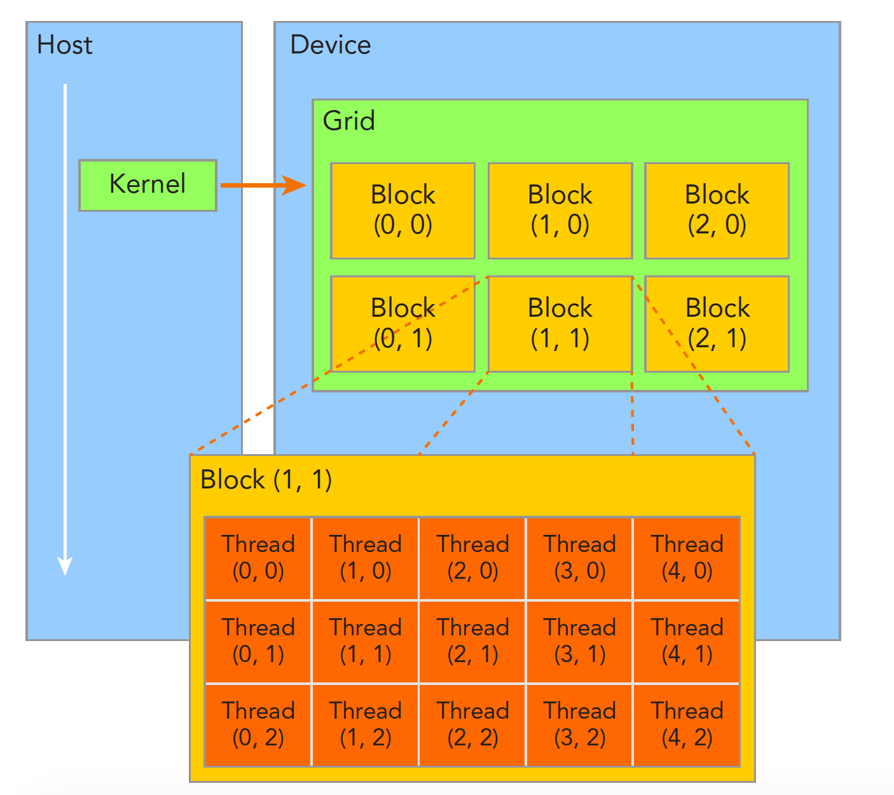

# CUDA Learn

## CUDA Thread Model

线程网格（grid）中包含多个线程块（block），均由dim3结构体进行表述，具有三个维度x、y、z，表示不同维度线程数量的范围，在调用核函数时进行传递，从而对内核进行配置。

在核函数内部，存在访问当前线程索引的变量，blockIdx表示当前线程块在线程网格内的位置索引，threadIdx表示当前线程在线程块内的位置索引，blockIdx与threadIdx均代表一个相对上一级线程集合的三维坐标，同样具有x、y、z三个成员。也可以通过gridDim，blockDim来访问网格大小和内存块的大小。
```cpp
kernel_name<<<4, 8>>>(argument list);
// 代表grid为 4 * 1 * 1， block为 8 * 1 * 1
```
内存通常都是线性编址的，所以在将线程对应到处理的数据时，通过gridDim、blockDim、blockIdx、threadIdx来计算线程的唯一索引，这个唯一索引应该是线性的

## Kernel Functions Limits
1. 只能访问内存设备
2. 必须有void返回类型
3. 不支持可变参数
4. 不支持静态变量
5. 显式异步行为

## CUDA Execute Model